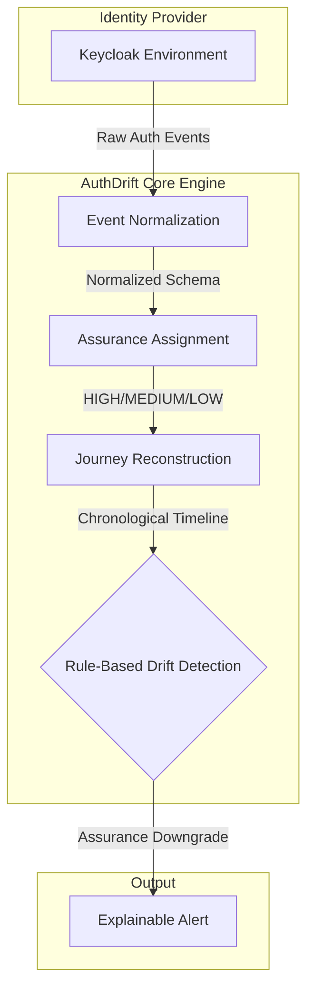
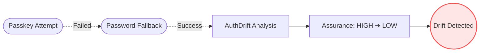

# AuthDrift: Authentication Assurance Drift Detection and Analysis

 

**AuthDrift** is a lightweight, vendor-neutral monitoring layer for analyzing **authentication assurance** across a user's entire authentication journey. 

Rather than viewing authentication events as isolated logs (e.g., "login failed," "password successful"), AuthDrift reconstructs a connected timeline. By doing so, it detects when a user begins with a strong authentication method but falls back to a weaker one within the same session—a phenomenon known as **Authentication Assurance Drift**.

---

## 🏗️ System Architecture & Pipeline

AuthDrift acts as a correlation layer that sits above identity providers like Keycloak. It normalizes raw events, determines their relative assurance levels, and analyzes the chronological journey.



---

## 🔍 The Core Concept: Assurance Drift

Modern identity systems generate thousands of individual events. A passkey failure might be normal. A password login might be permitted. But a *passkey failure followed immediately by a password login* represents a meaningful reduction in authentication assurance. 

AuthDrift flags this transition and explains the context, distinguishing it from isolated events.

### Example Scenario: Passkey Fallback



> **Note:** A drift is *not* automatically classified as an attack. Legitimate account recovery or new device migrations can cause drift. AuthDrift explains the transition so administrators have contextual awareness.

---

## 🎯 Prototype Objectives

The initial prototype focuses entirely on the core detection pipeline:

1. **Collect and Normalize Events**: Extract raw authentication events from Keycloak into a standardized common schema.
2. **Assurance Assignment**: Assign relative assurance levels to methods (e.g., Passkey = HIGH, Password = LOW).
3. **Journey Reconstruction**: Chronologically group events into unified authentication journeys per user.
4. **Drift Detection**: Identify when a strong authentication method is followed by a weaker authentication method within the same journey.

---

## 🧪 Controlled Test Scenarios

The prototype is validated against specific Keycloak scenarios to ensure accurate detection:

| ID | Scenario | Expected Outcome |
| :--- | :--- | :--- |
| **TC01** | Known-device passkey success | High assurance assigned; no drift detected. |
| **TC02** | Passkey ➔ Password fallback | Events grouped; assurance decreases; drift flagged. |
| **TC03** | Passkey failure ➔ Password success | Failed strong method followed by weaker method; drift flagged. |
| **TC04** | Weaker auth ➔ New device | Context captured within the same journey. |
| **TC05** | Downgrade ➔ New authenticator | Journey captures the downgrade and registration context. |

---

## 👥 Team Responsibilities & Branches

The project is structured across modular feature branches to ensure parallel development before integrating into `main`.

| Team Member | Branch | Responsibilities |
| :--- | :--- | :--- |
| **Balaa** | `balaa/assurance-detection` | Assurance model, mapping logic, basic drift detection, output contracts. |
| **Tashi** | `tashi/keycloak-events` | Keycloak setup, auth scenarios, raw event extraction, schema normalization. |
| **Rohan** | `rohan/journey-ui` | Journey reconstruction, timeline representation, UI display of results. |
| **Varun** | `varun/testing` | Test cases, test data, expected/actual comparison, regression validation. |

---

## ⚙️ Development Workflow

1. **Clone the repository:**
   ```bash
   git clone https://github.com/balaa1407/AuthnDrift.git
   cd AuthnDrift
   ```
2. **Check out your assigned branch:**
   ```bash
   git checkout <your-branch-name>
   ```
3. **Install the shared dependencies:**
   ```bash
   pip install -r requirements.txt
   ```
4. **Run the test suite:**
   ```bash
   pytest tests/
   ```

*(Ensure all interface compatibility is reviewed before opening Pull Requests against `main`.)*